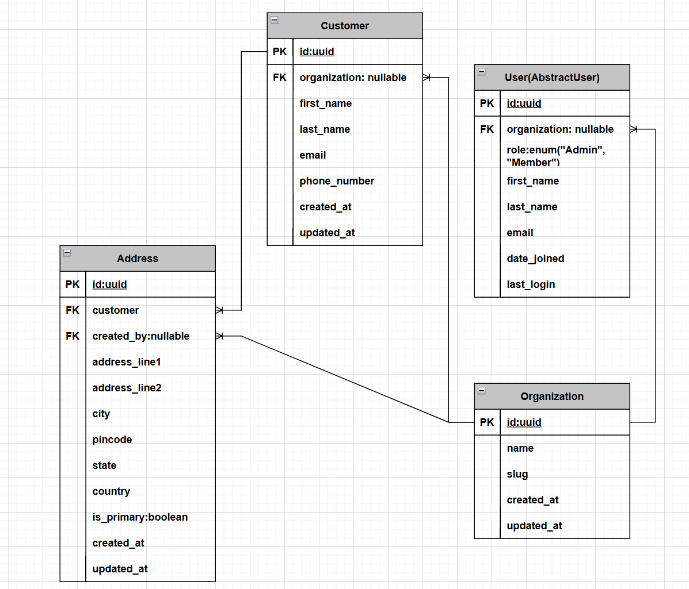
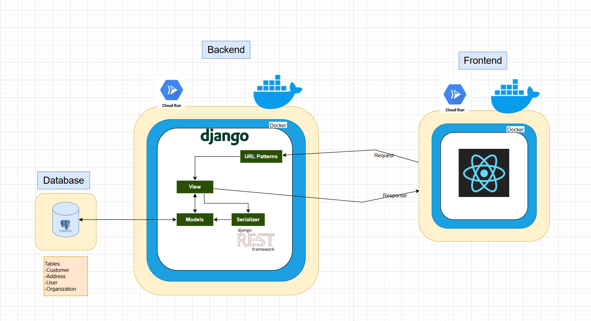

# Rootlogic CRM

## Tech Stack:
- **Frontend:** Typescript + React + MUI + Vite + React Router
- **Backend:** Python + Django + Django REST Framework
- **Database:** Postgres hosted in a VM
- **Deployment:** Google Cloud Run 

## Entity Relational Design    



## Architecture Overview

## 

## Development Overview
**Why four entities?**

I started the development by designing the table relations. At the begining, I thought about wrapping the CRUD operations with multi tanent authentication. By which, every user will sign up and join an organization, but the this will distract me from the main focus of the project. Therefore, I considired the entities **User** and **Organization** to reduce the tech debt of developing the multi-tanent authentication. Also, the **User** table would help for the Django admin panel authentication, which is helpful for debugging. 

**What is the benefit of unused tables?**

For this project scope, we might not need multi tantent authentication. However, the project is meant to be as a CRM and having these tables will support scaling the application to an oranizational level. More like a B2B SaaS. 
## API Documentation
API docs are hosted at:

Swagger: `${BACKEND_BASE_URL}/api/schema/swagger-ui/`

Redoc: `${BACKEND_BASE_URL}/api/schema/redoc/`

## Backend Development Setup
To set up the Django project in your machine, it's recommended to have a python virtual enviorment
```bash
python -m venv venv
source venv/bin/activate
pip install -r requirments.txt
```

To setup the backend in a docker container, follow this:
```bash
docker build -t rootlogic:latest .
docker run --env-file .env -p 8000:8080 rootlogic:latest
```

## Database Setup
To setup DB schemas, make sure you put the right credentials for the **Postgres** database in the envirmoent variable. 

*Follow `example.env` for more info*

```bash
# setup schema
python manage.py makemigrations
python manage.py migrate
```